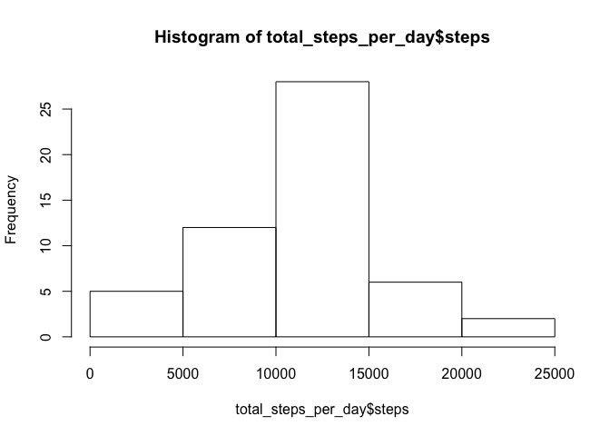
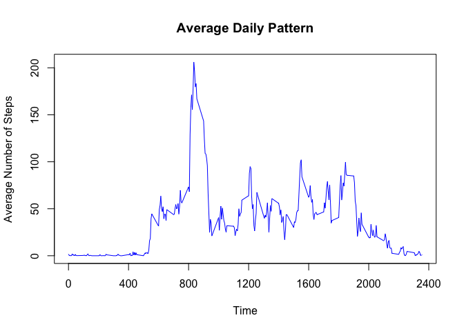
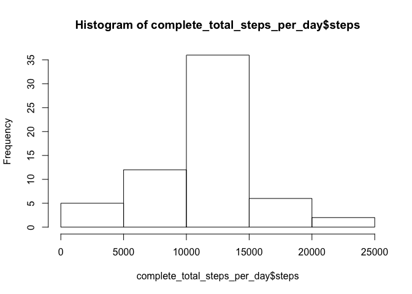

# Reproducible Research: Peer Assessment 1
Melisa Brown  

## Loading and preprocessing the data
1. Load the data (i.e. read.csv())
    
    ```r
    # download zipped file from url
    URL <- "https://d396qusza40orc.cloudfront.net/repdata%2Fdata%2Factivity.zip"
    zipped_file <- basename(URL)
    download.file(URL, zipped_file)  
    # unzip file
    unzip(zipped_file)
    # load data from csv
    raw_data <- read.csv("activity.csv")
    head(raw_data)
    ```
    
    ```
    ##   steps       date interval
    ## 1    NA 2012-10-01        0
    ## 2    NA 2012-10-01        5
    ## 3    NA 2012-10-01       10
    ## 4    NA 2012-10-01       15
    ## 5    NA 2012-10-01       20
    ## 6    NA 2012-10-01       25
    ```

2. Process/transform the data (if necessary) into a format suitable for your analysis  

    The read.csv() function stores the CSV file as a data frame, which is suitable for analysis, so no further processing is necessary.  
  
  
## What is the mean total number of steps taken per day?
The instructions state that for this part of the assignment, we should ignore the missing values in the dataset. To do this, we can create a subset of the data that contains only complete row entries, i.e. there are no NA values in the "steps" column.

```r
cleaned_data <- subset(raw_data, is.na(raw_data$steps) == F)
```

1. Calculate the total number of steps taken per day
    
    ```r
    total_steps_per_day <- aggregate(. ~ date, data=cleaned_data[,1:2], FUN=sum)
    head(total_steps_per_day)
    ```
    
    ```
    ##         date steps
    ## 1 2012-10-02   126
    ## 2 2012-10-03 11352
    ## 3 2012-10-04 12116
    ## 4 2012-10-05 13294
    ## 5 2012-10-06 15420
    ## 6 2012-10-07 11015
    ```

2. Make a histogram of the total number of steps taken each day
    
    ```r
    hist(total_steps_per_day$steps)
    ```
    
     

3. Calculate and report the mean and median of the total number of steps taken per day
    
    ```r
    options(scipen=999) #disables scientific notation when printing
    mean_steps <- round(mean(total_steps_per_day$steps), digits=2)
    mean_steps
    ```
    
    ```
    ## [1] 10766.19
    ```
    
    ```r
    median_steps <- median(total_steps_per_day$steps)
    median_steps
    ```
    
    ```
    ## [1] 10765
    ```

    The mean of the total number of steps per day is **10766.19** and the median is **10765**.


## What is the average daily activity pattern?
1. Make a time series plot (i.e. 𝚝𝚢𝚙𝚎 = "𝚕") of the 5-minute interval (x-axis) and the average number of steps taken, averaged across all days (y-axis).
    
    ```r
    avg_steps_per_int <- aggregate(. ~interval, data=cleaned_data[,c(1,3)], FUN=mean)
    head(avg_steps_per_int)
    ```
    
    ```
    ##   interval     steps
    ## 1        0 1.7169811
    ## 2        5 0.3396226
    ## 3       10 0.1320755
    ## 4       15 0.1509434
    ## 5       20 0.0754717
    ## 6       25 2.0943396
    ```
    
    ```r
    plot(avg_steps_per_int, type="l", col="blue", xaxt = "n", 
         main="Average Daily Pattern", xlab="Time", ylab="Average Number of Steps")
    axis(side=1, at=seq(from=0, to=2400, by=400))
    ```
    
     

2. Which 5-minute interval, on average across all the days in the dataset, contains the maximum number of steps?
    
    ```r
    max_val <- max(avg_steps_per_int$steps)
    max_interval <- 
        avg_steps_per_int$interval[which(avg_steps_per_int$steps==max_val)]
    max_interval
    ```
    
    ```
    ## [1] 835
    ```
    The interval ending at **835** contains tha maximum number of steps.


## Imputing missing values
Note that there are a number of days/intervals where there are missing values (coded as 𝙽𝙰). The presence of missing days may introduce bias into some calculations or summaries of the data.

1. Calculate and report the total number of missing values in the dataset (i.e. the total number of rows with 𝙽𝙰s)
    
    ```r
    total_missing <- sum(is.na(raw_data))
    total_missing
    ```
    
    ```
    ## [1] 2304
    ```

    The total number of missing values in the dataset is **2304**.  
    
2. Devise a strategy for filling in all of the missing values in the dataset. The strategy does not need to be sophisticated. For example, you could use the mean/median for that day, or the mean for that 5-minute interval, etc.

    At first I was going to use the median number of steps for that day in order to fill in the NA values. However, for some days such as "2012-10-01" all the intervals have NA values. Therefore, I decided to fill in NA values with the average value over all the days for that 5-minute interval, which was already computed and stored in the variable "avg_steps_per_int". Since this average will most likely not be a whole number, I rounded this number to the nearest integer value, so account for the fact that the real world situtation would not have partial steps. This method accomplished via the function "FIND_AVG_STEPS", which takes as input the row number of an NA value, and outputs the average steps per interval(across all days) for the interval corresponding to the row number.
    
    ```r
    FIND_AVG_STEPS <- function(rowNum){
        steps <- round(avg_steps_per_int$steps
                   [which(raw_data[rowNum,3]==avg_steps_per_int$interval)],
                   digits=0)
        return(steps)
    }
    ```

3. Create a new dataset that is equal to the original dataset but with the missing data filled in.

    First the rows with NA values are stored in the vector "na_rows", then the NA values in these rows are replaced with the average steps per interval. The new data frame with the NA values replaced is called "filled_data".

    
    ```r
    na_rows <- which(is.na(raw_data$steps)==TRUE)
    filled_data <- raw_data
    head(filled_data)
    ```
    
    ```
    ##   steps       date interval
    ## 1    NA 2012-10-01        0
    ## 2    NA 2012-10-01        5
    ## 3    NA 2012-10-01       10
    ## 4    NA 2012-10-01       15
    ## 5    NA 2012-10-01       20
    ## 6    NA 2012-10-01       25
    ```
    
    ```r
    for (i in na_rows) {
        filled_data[i,1] <- FIND_AVG_STEPS(rowNum=i)
    }
    head(filled_data)
    ```
    
    ```
    ##   steps       date interval
    ## 1     2 2012-10-01        0
    ## 2     0 2012-10-01        5
    ## 3     0 2012-10-01       10
    ## 4     0 2012-10-01       15
    ## 5     0 2012-10-01       20
    ## 6     2 2012-10-01       25
    ```

4. Make a histogram of the total number of steps taken each day. 
    
    ```r
    # Calculate the total number of steps taken per day
    complete_total_steps_per_day <- aggregate(. ~ date, data=filled_data[,1:2], FUN=sum)
    # Make a histogram of the total number of steps taken each day
    hist(complete_total_steps_per_day$steps)
    ```
    
     
    
    **Calculate and report the mean and median total number of steps taken per day.** 

    
    ```r
    imputed_mean_steps <- mean(complete_total_steps_per_day$steps)
    imputed_mean_steps
    ```
    
    ```
    ## [1] 10765.64
    ```
    
    ```r
    imputed_median_steps <- median(complete_total_steps_per_day$steps)
    imputed_median_steps
    ```
    
    ```
    ## [1] 10762
    ```

    **Do these values differ from the estimates from the first part of the assignment? What is the impact of imputing missing data on the estimates of the total daily number of steps?**

    Imputing missing data slightly lowers both the mean and median for total number of steps taken per day. The mean total daily number of steps disregarding NA values is **10766.19** and with imputed values is **10765.6393443**. The median values are **10765** without NA values and **10762** with imputed NA values.   


## Are there differences in activity patterns between weekdays and weekends?

For this part the 𝚠𝚎𝚎𝚔𝚍𝚊𝚢𝚜() function may be of some help here. Use the dataset with the filled-in missing values for this part.

1. Create a new factor variable in the dataset with two levels – “weekday” and “weekend” indicating whether a given date is a weekday or weekend day.
    
    ```r
    # use the weekdays() function to get the corresponding day of the week of the 
    # date column in filled_data and store in "days" vector
    days <- factor(weekdays(as.Date(filled_data$date, format="%Y-%m-%d")))
    day_type <- days
    weekdays <- c("Monday","Tuesday","Wednesday","Thursday","Friday")
    weekends <- c("Saturday", "Sunday")
    # convert the day of the week to either "weekday" or "weekend"
    for (day in weekdays) {
        day_type <- sub(day, "weekday", day_type)
    }
    for (day in weekends) {
        day_type <- sub(day, "weekend", day_type)
    }
    day_type <- factor(day_type, levels=c("weekday", "weekend"), ordered=TRUE)
    # add the day_type column to a new data frame "new_filled_data"
    new_filled_data <- cbind(filled_data, day_type)
    head(new_filled_data)
    ```
    
    ```
    ##   steps       date interval day_type
    ## 1     2 2012-10-01        0  weekday
    ## 2     0 2012-10-01        5  weekday
    ## 3     0 2012-10-01       10  weekday
    ## 4     0 2012-10-01       15  weekday
    ## 5     0 2012-10-01       20  weekday
    ## 6     2 2012-10-01       25  weekday
    ```


2. Make a panel plot containing a time series plot (i.e. 𝚝𝚢𝚙𝚎 = "𝚕") of the 5-minute interval (x-axis) and the average number of steps taken, averaged across all weekday days or weekend days (y-axis). 

    First the average number of steps across all days for each interval and day_type needs to be calculated. This is similar to what was done previously, however, there will be twice as many intervals since there are now two separate interval groups for "weekday" and "weekend".
    
    
    ```r
    #calculate average number of steps across all days for each interval
    avg_steps <- aggregate(. ~interval+day_type, data=new_filled_data[,c(1,3)], FUN=mean)
    head(avg_steps)
    ```
    
    ```
    ##   interval day_type      steps
    ## 1        0  weekday 2.28888889
    ## 2        5  weekday 0.40000000
    ## 3       10  weekday 0.15555556
    ## 4       15  weekday 0.17777778
    ## 5       20  weekday 0.08888889
    ## 6       25  weekday 1.57777778
    ```
    
    Next the lattice package can be used to make a panel plot for weekday versus weekend days.
    
    
    ```r
    library(lattice)
    xyplot(steps ~ interval|day_type, data = avg_steps, layout = c(1, 2), 
           type="l", xlab = "Interval", ylab = "Number of steps")
    ```
    
     
    
    We can see from the time series plot that weekend and weekday patterns do differ. On the weekend the person tends to have a more or less a constant pattern of activity during the daytime hours. On the weekday, the activity pattern start earlier at around 600, peaks at 830, and is lower in general than the weekend activity pattern during the daylight hours when the person is presumably at work and not walking around as much. We can confirm this pattern by looking at the summary statistics for the average number of steps taken on the weekend and weekday.
    
    
    ```r
    summary(avg_steps[avg_steps$day_type=="weekend",])
    ```
    
    ```
    ##     interval         day_type       steps        
    ##  Min.   :   0.0   weekday:  0   Min.   :  0.000  
    ##  1st Qu.: 588.8   weekend:288   1st Qu.:  1.234  
    ##  Median :1177.5                 Median : 32.312  
    ##  Mean   :1177.5                 Mean   : 42.365  
    ##  3rd Qu.:1766.2                 3rd Qu.: 74.609  
    ##  Max.   :2355.0                 Max.   :166.625
    ```
    
    ```r
    summary(avg_steps[avg_steps$day_type=="weekday",])
    ```
    
    ```
    ##     interval         day_type       steps        
    ##  Min.   :   0.0   weekday:288   Min.   :  0.000  
    ##  1st Qu.: 588.8   weekend:  0   1st Qu.:  2.289  
    ##  Median :1177.5                 Median : 25.811  
    ##  Mean   :1177.5                 Mean   : 35.609  
    ##  3rd Qu.:1766.2                 3rd Qu.: 50.806  
    ##  Max.   :2355.0                 Max.   :230.356
    ```
